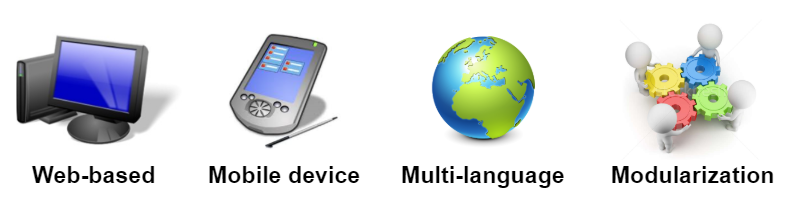
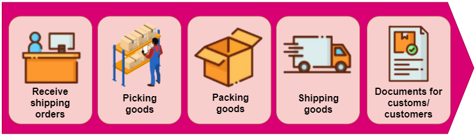
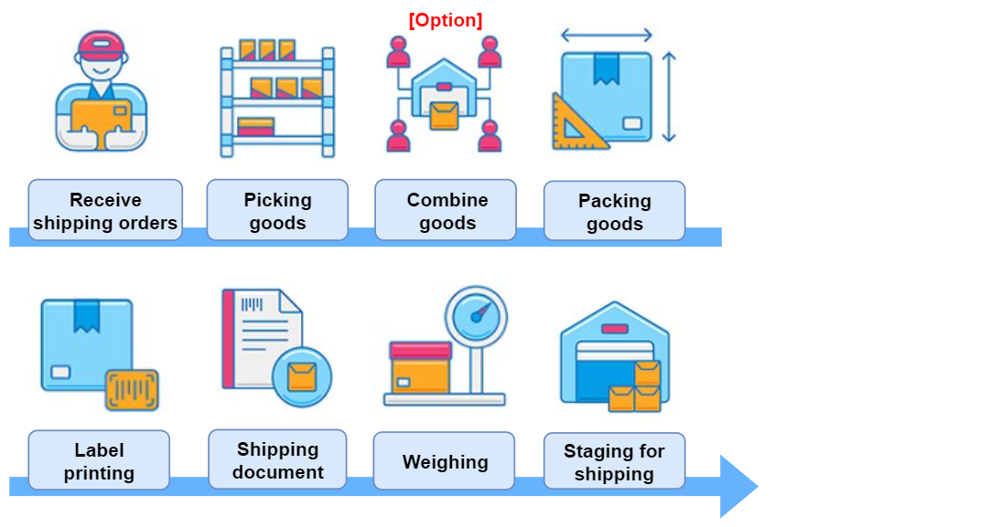
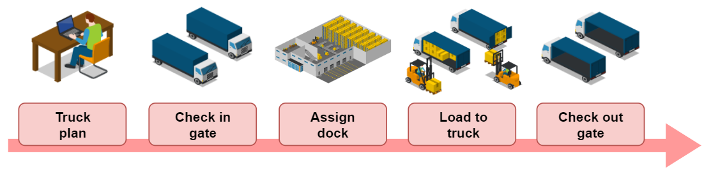
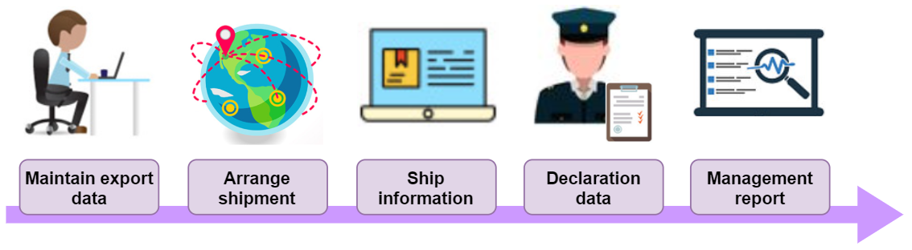
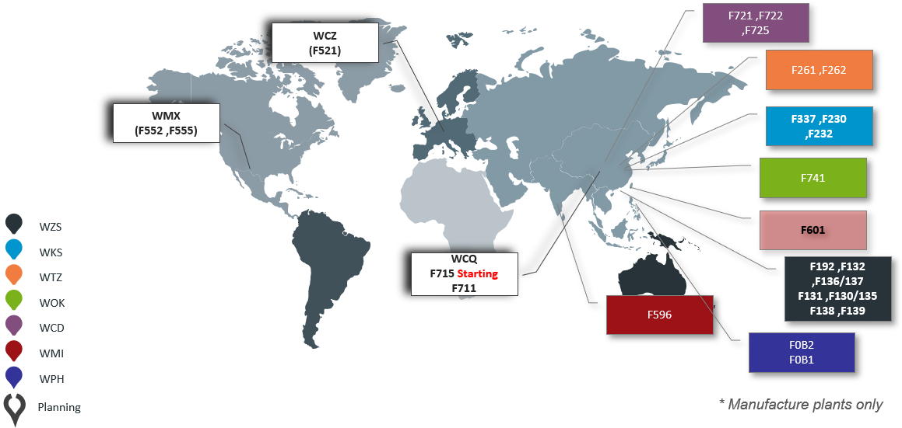

# LMS CIM On-Line Documentation

# **LMS (Logistics Management System)**

**Logistics management** is a supply chain management component that is used to meet customer requirements through the planning, control and implementation of the effective movement and storage of related information, goods and services from origin to destination. For the purpose of meeting customer requirement, logistics management helps companies deliver right product and  quantity to the specified place in specified time. In addition, It also helps companies reduce expenses and enhance customer service satisfaction.

## **The Features**

## **Logistics Process**

## **LMS Module**
### The system integrates:
#### - **PP**: Warehouse Pick - Pack ship operation

#### - **TP**: Transportation operation

#### - **EP**: Exportation relative document creation

#### - **LE**: Global logistics expense calculation (Exclude temporarily)
#### - **WM**: Warehouse Management [(See more information)](http://10.37.36.18:801/WMS_Doc/)

## **W.W. LMS Distribution**
 

